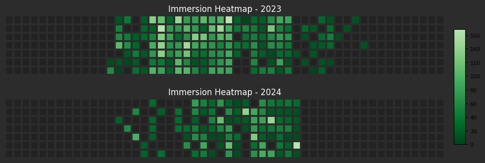

# Heatmap Generator

Create a heatmap from your TMW immersion logs

## Features

- Create a heatmap of your immersion data
- Chose to view all immersion media types or filter by a  media type.


## Requirements
Some basic familiarity with how your operating system's terminal/shell works. The latest version of the Python programming language also needs to be installed.

## Installation

To install the package, you can use either the `.whl` file or the `.tar.gz` file provided in the repository. First, open your OS terminal (bash, windows powershell, whatever BS apple uses) and navigate to the `dist` folder
```bash
cd dist
```
 Choose one of the methods below:

### Using the `.whl` file:

```bash
pip install immersion_heatmap-0.1.0-py3-none-any.whl
```

### Using the `.tar.gz` file:

```bash
pip install immersion_heatmap-0.1.0.tar.gz
```

Make sure to navigate to the directory where these files are located before running the installation commands or execute them using the file path.

## Usage

After installing the package, you can use the script from the terminal to generate heatmaps. Below are the instructions on how to run the script with different options:

### Basic Usage

To generate a heatmap, run the script with the following command:

```bash
python -m immersion_heatmap --input your_data_file.csv --output your_output_file.png
```

Replace `your_data_file.csv` with the path to your dataset and `your_output_file.png` with the desired output filename.

### Automatic Data Reading

You can download your immersion logs and place them in `immersion_stats/data` folder. The script will automatically read data from this file, and you will not need to specify the `--input` parameter. Just specify the `--output` parameter to save the heatmap:

```bash
python -m immersion_heatmap --output your_output_file.png
```

### Command-line Options

- `--input`: **(Required if no CSV file is in `immersion_stats/data`)** The path to the CSV file containing the data for which you want to generate a heatmap.
- `--output`: **(Required)** The path where you want to save the generated heatmap image.
- `--cmap`: **(Optional)** The name of the colormap to use (e.g., `Greens`, `Reds`). If not specified, a default colormap will be used. You can use any heatmap available to [matplotlib](https://matplotlib.org/stable/users/explain/colors/colormaps.html) although I wouldn't recommend a diverging one. The 'Sequential' maps are revered to more closely resemble anki's heatmap addon.
- `--media`: **(Optional)** What media type to show on the heatmap. The default is to show all media types, but you can chose from any of the logging types accepted by the immersion bot ```ANIME, VN, BOOK, MANGA, READTIME, LISTENING, READING```


### Example

To generate a heatmap from a dataset called `username_logs.csv` and save the output as `heatmap.png`, you can run:

```bash
python -m immersion_heatmap --input username_logs.csv --output heatmap --cmap Blues
```

This command uses the `Blues` colormap. PNG is the default save type so the file exstension can be omitted. An example image might look something like:



An example of filter by visual novel logs might be
```bash
python -m immersion_stats --output listening_example --media listening
```

You can use this as a reference to see how your own heatmaps might look like.


## License

This project is licensed under the MIT License - see the [LICENSE](LICENSE) file for details.
