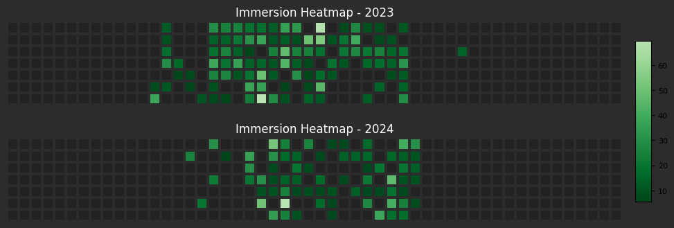

# Heatmap Generator

Create a heatmap from your TMW immersion logs.

## Introduction

The **Heatmap Generator** is a Python tool designed to create visual representations of your immersion data from TMW immersion logs. This tool provides a simple and effective way to generate heatmaps from your data.


## Features

- Generate heatmaps from immersion data logs.
- Filter heatmaps by specific media types (e.g., anime, books, listening).
- Customize the appearance of heatmaps using different colormaps.

## Prerequisites

Before you begin, ensure you have the following installed on your system:

- **Python**: Version 3.6 or higher.
- **Git**: Required if you prefer to clone the repository rather than download it directly.

### Installing Python and Git

1. Download Python from the [official website](https://www.python.org/downloads/).
2. Download Git from the [official website](https://git-scm.com/).

## Installation

Follow these steps to set up the Heatmap Generator on your system.

### Step 1: Download the Repository

Choose one of the following methods to obtain the Heatmap Generator repository:

#### Option A: Clone the Repository Using Git

1. Open your terminal.
2. Run the following command:

   ```bash
   git clone https://github.com/edsml-jjl122/tmw_heatmap.git
   ```
https://github.com/user-attachments/assets/47677b3d-b082-4e81-997c-2ac123b70671

#### Option B: Download the Repository as a ZIP File

1. Visit the repository on GitHub.
2. Click the green "Code" button, then select "Download ZIP".
3. Extract the ZIP file to your desired location.


### Step 2: Install the Package

To install the package, navigate to the directory where the repository is located, then to the `dist` folder:

```bash
cd path/to/tmw_heatmap/dist
```

Then, run one of the following commands based on the file type you wish to install:

#### Install Using the `.whl` File:

```bash
pip install immersion_heatmap-0.1.0-py3-none-any.whl
```

## Usage

After installation, you can use the script to generate heatmaps. Here’s how to run the script.

### Basic Usage

To generate a heatmap, use the following command structure:

```bash
python -m immersion_heatmap --input your_data_file.csv --output your_output_file.png
```

### Command-line Options

- `--input`: **(Optional if CSV is in `immersion_stats/data`)** The path to your CSV file containing the data.
- `--output`: **(Required)** The path where you want to save the heatmap image.
- `--cmap`: **(Optional)** The colormap to use (e.g., `Greens`, `Reds`). Defaults to a standard colormap if not specified. Refer to [matplotlib's colormap documentation](https://matplotlib.org/stable/users/explain/colors/colormaps.html) for more options.
- `--media`: **(Optional)** Filter by media type (e.g., `ANIME, VN, BOOK`). Defaults to all types.

### Example 1

To generate a heatmap from `username_logs.csv` and save it as `heatmap.png` with the `Blues` colormap:

```bash
python -m immersion_heatmap --input username_logs.csv --output heatmap --cmap Blues
```
### Example 2
If you save your TMW logs to the immersion_heatmap/data folder, the program will automatically use that data.
_warning_: this method only works if there is a single file in the data folder.

https://github.com/user-attachments/assets/cfd4d006-8327-48ed-8b73-28226c60ca73

```bash
python -m immersion_heatmap --output examples/data_folder
```

### Example 3

For a media-specific heatmap:

```bash
python -m immersion_heatmap --output listening_example --media listening
```


## Contributing

It would be great if someone could take this and add it to TMW logging bot. I gave it the ole college try but couldn't figure it out.

## Contact Information

You you can any issues, raise them here or PM me on discord @ n0luck13

## License

This project is licensed under the MIT License - see the [LICENSE](LICENSE) file for details.
